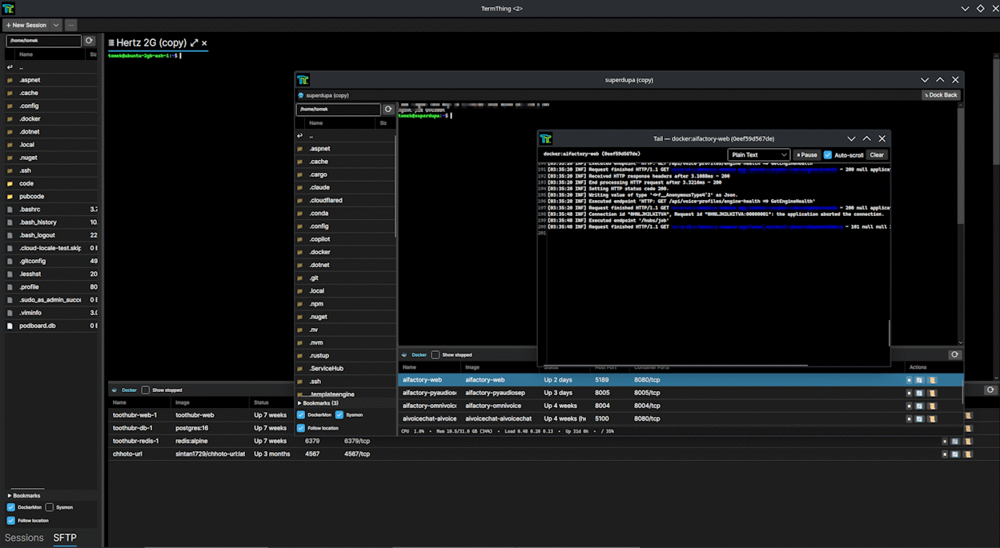

# TermThing

Yet another terminal emulator thing. Desktop, portable, tab and floating window focused, SFTP baked-in corss-platform terminal application (inspired by MobaXTerm) built on .NET 10 and Avalonia. 



> Early development, expect rough edges.

## Features

- **Built-in SFTP browser**
- **Floating tab windows**
- **Integrated text editor**
- **Tail / follow any file**
- **Docker monitor panel with Docker log tails**
- **Portable JSON config**

### Todo

- **Serial support**
- **tmux API integration**

## Requirements

- [.NET 10 Runtime](https://dotnet.microsoft.com/download/dotnet/10.0) (for running)
- [.NET 10 SDK](https://dotnet.microsoft.com/download/dotnet/10.0) (for building from source)

## Running

Download the latest release and run the executable directly. Requires the .NET 10 runtime.

## Building

Requires the .NET 10 SDK.

```powershell
git clone --recurse-submodules https://github.com/tomeko/termthing
cd termthing
dotnet build src/TermThing.sln
dotnet run --project src/TermThing.csproj
```

If you already cloned without `--recurse-submodules`:

```powershell
git submodule update --init --recursive
```

## Acknowledgements

- [Iciclecreek.Avalonia.Terminal](https://github.com/tomlm/Iciclecreek.Avalonia.Terminal) by Tom Laird-McConnell: the terminal control powering every session. Really what makes this tick.
- [SSH.NET](https://github.com/sshnet/SSH.NET): All stuff SSH
- [AvaloniaEdit](https://github.com/AvaloniaUI/AvaloniaEdit) and [AvaloniaEdit.TextMate](https://github.com/AvaloniaUI/AvaloniaEdit): Code editor with TextMate grammar support.
- [TextMateSharp.Grammars](https://github.com/danipen/TextMateSharp): Bundled TextMate grammar definitions.
- [Material.Icons.Avalonia](https://github.com/AvaloniaUtils/Material.Icons.Avalonia): Icons.
- [Cascadia Code](https://github.com/microsoft/cascadia-code) and [Inter](https://rsms.me/inter/): Bundled fonts (SIL Open Font License 1.1).

## License

MIT: see [LICENSE](LICENSE).

Bundled fonts (Cascadia Code, Inter) are distributed under the [SIL Open Font License 1.1](https://scripts.sil.org/OFL).
