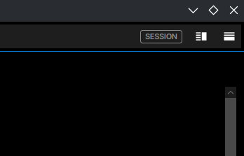
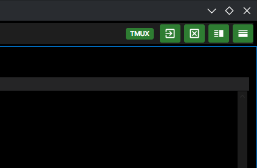
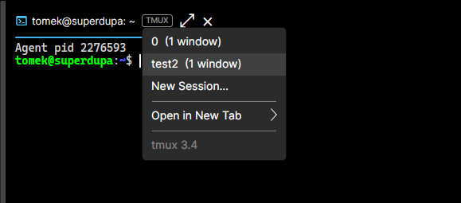
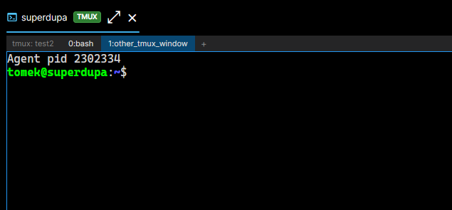

**TermThing:** Yet another terminal emulator thing inspired by the likes of MobaXTerm. Cross-platform desktop application built on dotnet 10/Avalonia, built on the shoulders of some really awesome dotnet libraries.


# Features

- **tmux api integration for native rendering/control**
- **sftp browser built in**
- **tabbed interface with floating windows**
- **text editor with syntax highlighting**
- **docker monitor, tail log windows, portable JSON config**

# Status
It's a terminal emulator built by some random internet stranger. Don't assume this is battle-tested or comes with any warranty. That being said I built it for me and use it as a daily driver.

## Requirements

- [.NET 10 Runtime](https://dotnet.microsoft.com/download/dotnet/10.0) (for running)
- [.NET 10 SDK](https://dotnet.microsoft.com/download/dotnet/10.0) (for building from source)

## Installation

- Download the [latest release](https://github.com/tomeko/termthing/releases/latest) and run the executable directly (Requires .NET 10 runtime). Or build and run (see below)

## Building

Requires the .NET 10 SDK.

```powershell
git clone https://github.com/tomeko/termthing
cd termthing
dotnet build src/TermThing.sln
dotnet run --project src/TermThing.csproj
```
# Docs

_todo, starting with the most non-obvious stuff below_

## Native vs tmux modes
- Pane management can be done natively or in tmux mode
- Native panes are just separate SSH sessions, tmux are actual panes/windows via api (tmux >= 3.2)
  - Older tmux: falls back to "legacy" mode, the attach is typed into the shell, tmux draws its own UI inside a single terminal

 Top right area shows you which mode you're in. Containts detach, close pane, split right, split down buttons





## Tmux mode

- Attaching/detaching/spawning sessions is done with the tmux button in the session tab header (green if in tmux mode, see image below)
- If there is more than one pane (split), when selected it'll have a blue border (for detach, further split)




- There's a subheader containing tmux windows (also create new, rename, etc. See image below)



# Updating

Built-in updater will notify/pull/update from github releases

# FAQ

## Q. ???

## A. ...


# Acknowledgements

- [Iciclecreek.Avalonia.Terminal](https://github.com/tomlm/Iciclecreek.Avalonia.Terminal) by Tom Laird-McConnell: the terminal control powering every session. Really what makes this tick.
- [SSH.NET](https://github.com/sshnet/SSH.NET): All stuff SSH
- [AvaloniaEdit](https://github.com/AvaloniaUI/AvaloniaEdit) and [AvaloniaEdit.TextMate](https://github.com/AvaloniaUI/AvaloniaEdit): Code editor with TextMate grammar support.
- [TextMateSharp.Grammars](https://github.com/danipen/TextMateSharp): Bundled TextMate grammar definitions.
- [Material.Icons.Avalonia](https://github.com/AvaloniaUtils/Material.Icons.Avalonia): Icons.
- [Cascadia Code](https://github.com/microsoft/cascadia-code) and [Inter](https://rsms.me/inter/): Bundled fonts (SIL Open Font License 1.1).

# License

MIT: see [LICENSE](LICENSE).

Bundled fonts (Cascadia Code, Inter) are distributed under the [SIL Open Font License 1.1](https://scripts.sil.org/OFL).
