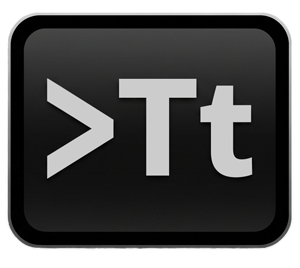
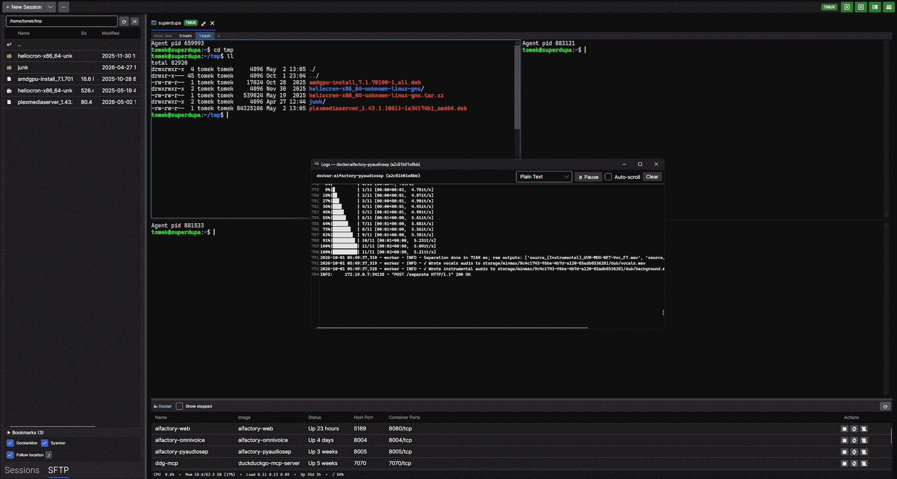

**TermThing:** Yet another terminal emulator thing inspired by the likes of MobaXTerm. Cross-platform desktop application built on dotnet 10/Avalonia, built on the shoulders of some really awesome dotnet libraries.



## Features

- **tmux api integration**
  - native UX panes/windows/control through tmux api
- **sftp browser**
  - always on file explorer
- **tabbed interface with floating windows**
  - for those who aren't TUI obsessed
- **text editor with syntax highlighting**
  - quick edits
- **docker monitor, tail log windows, portable JSON config**

## Status
It's a terminal emulator built by some random internet stranger. Don't assume this is battle-tested or comes with any warranty. That being said I built it for me and use it as a daily driver, among my many vibe-by-flight projects this isn't one of them.

## Docs

_todo_

## Requirements

- [.NET 10 Runtime](https://dotnet.microsoft.com/download/dotnet/10.0) (for running)
- [.NET 10 SDK](https://dotnet.microsoft.com/download/dotnet/10.0) (for building from source)

## Running

Download the latest release and run the executable directly (Requires .NET 10 runtime)

## Updating

Built-in updater will notify/pull/update from github releases

## Building

Requires the .NET 10 SDK.

```powershell
git clone https://github.com/tomeko/termthing
cd termthing
dotnet build src/TermThing.sln
dotnet run --project src/TermThing.csproj
```
## FAQ

### Q. ???

### A. ...


## Acknowledgements

- [Iciclecreek.Avalonia.Terminal](https://github.com/tomlm/Iciclecreek.Avalonia.Terminal) by Tom Laird-McConnell: the terminal control powering every session. Really what makes this tick.
- [SSH.NET](https://github.com/sshnet/SSH.NET): All stuff SSH
- [AvaloniaEdit](https://github.com/AvaloniaUI/AvaloniaEdit) and [AvaloniaEdit.TextMate](https://github.com/AvaloniaUI/AvaloniaEdit): Code editor with TextMate grammar support.
- [TextMateSharp.Grammars](https://github.com/danipen/TextMateSharp): Bundled TextMate grammar definitions.
- [Material.Icons.Avalonia](https://github.com/AvaloniaUtils/Material.Icons.Avalonia): Icons.
- [Cascadia Code](https://github.com/microsoft/cascadia-code) and [Inter](https://rsms.me/inter/): Bundled fonts (SIL Open Font License 1.1).

## License

MIT: see [LICENSE](LICENSE).

Bundled fonts (Cascadia Code, Inter) are distributed under the [SIL Open Font License 1.1](https://scripts.sil.org/OFL).
